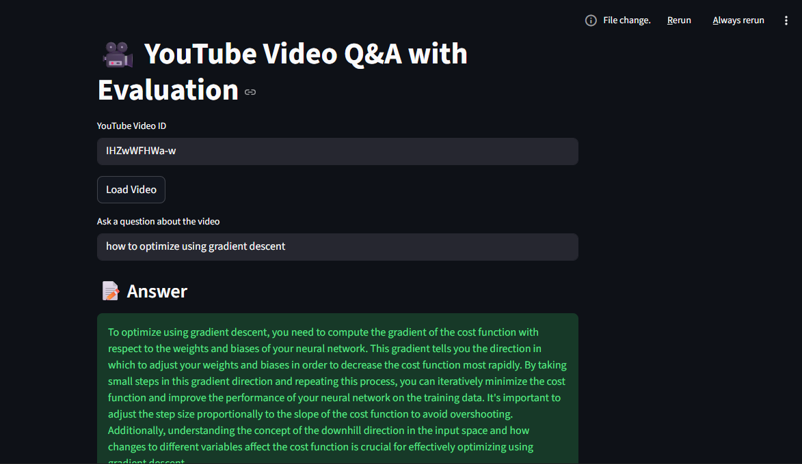
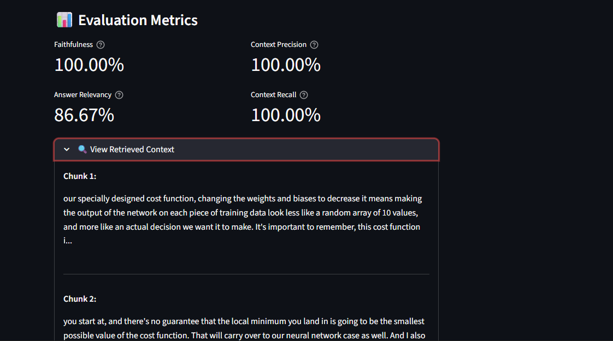

# 🎬 YouTube AI Assistant

> A smart AI-powered assistant that lets you interact with any YouTube video — ask questions, get summaries, and explore content broken into meaningful sections.

---

## 📸 Demo & Screenshots


| Feature           | Screenshot               |
| ----------------- | ------------------------ |
| Home / URL Input  |  |
|                   |
| Section Breakdown |  |

---

## ✨ Features

- 🔗 **Paste any YouTube Video id** to load video content
- 💬 **Chat with the video** — ask questions and get context-aware answers
- 📝 **Summarize** the entire video in seconds
- 🗂️ **Section breakdown** — splits video content into meaningful, labeled segments
- ⚡ Powered by **Streamlit** for a clean, interactive UI

---

## 🛠️ Tech Stack

- **Frontend**: Streamlit
- **AI/LLM**: (your model/API here — e.g., OpenAI, Gemini, etc.)
- **YouTube Processing**: (e.g., `youtube-transcript-api`, `pytube`)
- **Language**: Python 3.x

---

## 🚀 Getting Started

Follow these steps to clone and run the project locally.

### 1. Clone the Repository

```bash
git clone https://github.com/geniusdude1012/Youtube_AI_Assistant.git
cd Youtube_AI_Assistant
```

### 2. Create & Activate a Virtual Environment _(recommended)_

```bash
# On macOS/Linux
python3 -m venv venv
source venv/bin/activate

# On Windows
python -m venv venv
venv\Scripts\activate
```

### 3. Install Dependencies

```bash
pip install -r requirements.txt
```

### 4. Set Up Environment Variables

Create a `.env` file in the root of the project:

```bash
touch .env
```

Then open it and add your API keys:

```env
# .env

OPENAI_API_KEY=your_openai_api_key_here
# Add any other required keys below
# GOOGLE_API_KEY=your_key_here
```

> ⚠️ **Never commit your `.env` file.** It is already listed in `.gitignore`.

### 5. Run the App

```bash
streamlit run yt_smrt_asst.py
```

The app will open automatically in your browser at `http://localhost:8501`.

---

## 📁 Project Structure

```
Youtube_AI_Assistant/
│
├── tests/                  # Test files for RAG system
├── .gitignore
├── LICENSE
├── README.md
├── requirements.txt        # All Python dependencies
└── yt_smrt_asst.py         # Main Streamlit application
```

---

## 🧪 Running Tests

```bash
# From the root directory
pytest tests/
```

---

## 🤝 Contributing

Contributions are welcome! Here's how to get started:

1. Fork the repository
2. Create a new branch: `git checkout -b feature/your-feature-name`
3. Commit your changes: `git commit -m "Add your message"`
4. Push to the branch: `git push origin feature/your-feature-name`
5. Open a Pull Request

---

## 📄 License

This project is licensed under the **MIT License** — see the [LICENSE](LICENSE) file for details.

---

## 👤 Author

**geniusdude1012** · [GitHub Profile](https://github.com/geniusdude1012)

---

_Made with ❤️ and a lot of YouTube videos._
